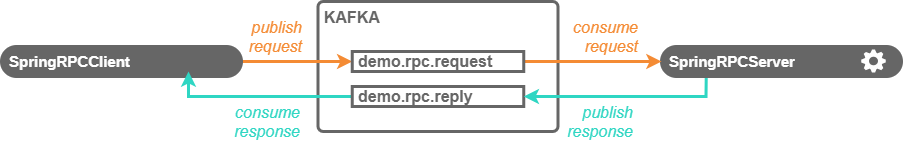
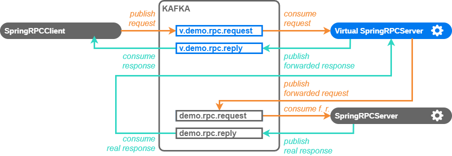
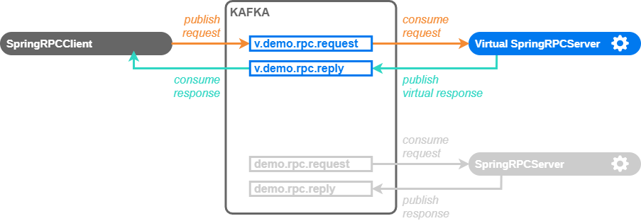

# Spring KafkaTemplate Request-Reply Learning And Simulation Demo

A demonstration of Apache Kafka service simulation and learning.



This demo contains implementation of client and service performing synchronous
JSON request/response communication over Kafka topics using the
[Spring KafkaTemplate](https://docs.spring.io/spring-kafka/api/org/springframework/kafka/core/KafkaTemplate.html)
helper facilitating the Kafka access in applications built with the
[Spring framework](https://spring.io/) that can be run with the `run-client[.sh|.bat]`
and `run-service[.sh|.bat]` scripts. It demonstrates the learning and
simulation of Kafka service with the _sv-capture_ tool.  

The demo includes virtual lab with pre-built model of the service so the 
simulation can be run out of box without learning.

See the [SV Lab Kafka connector online documentation](https://admhelp.microfocus.com/documents/sv/sv-lab/5.4/protocol-guide/kafka-connector.html)
for detailed description of all configuration options.

## Prerequisites

The demo client and service connect to a Kafka broker installed at localhost.
You can follow the [Apache Kafka Quickstart](https://kafka.apache.org/quickstart)
to download and run Kafka.

After downloading, you need to run the Zookeeper in one shell window:
 
```sh
bin/zookeeper-server-start.sh config/zookeeper.properties
```

In Windows:

```bat
bin\windows\zookeeper-server-start.bat config\zookeeper.properties
```

Then run Kafka in second shell:

```sh
bin/kafka-server-start.sh config/server.properties
```

In Windows:

```bat
bin\windows\kafka-server-start.bat config\server.properties
```


## Running the demo

First make sure the _SV lab server_ is running by launching `server-start[.sh|.bat]` 
from server's `bin/` directory.


### Out of box service simulation

Run the _sv[.sh|.bat]_ tool available in the `Lab/bin` directory in SV Lab 
distribution from the `demo/fibonacci-kafka-springrpc` directory to launch the 
ready-made virtual lab simulating the `compute` application
scenario:
```sh
sv.sh load -f -lab sv-lab/sv-lab.json -vsl sv-lab/demo start -a compute \
      log -a -f remove
```

In Windows:
```bat
sv.bat load -f -lab sv-lab\sv-lab.json -vsl sv-lab\demo start -a compute ^
       log -a -f remove
```

Then start the client configured to use virtual service with the 
`run-client-virtualized[.sh|.bat]` script. The client will display results based
on responses of the virtual service:

```
      _        __  __  __  __
|/ _ /_|  _   |__)|__)/    | \  _  _ _  _
|\(_|| |<(_|  | \ |   \__  |_/ (_'| | |(_)
2020-10-15 11:23:16.041  INFO 66480 --- [main] demo.SpringRpcClient: Starting SpringRpcClient on Jupiter with PID 25042 (C:\test\Lab\demo\fibonacci-kafka-springrpc\target\classes started by Jirka in C:\test\Lab\demo\fibonacci-kafka-springrpc)
2020-10-15 11:23:16.055  INFO 66480 --- [main] demo.SpringRpcClient: The following profiles are active: client,virtualized
2020-10-15 11:23:18.329  INFO 66480 --- [main] demo.SpringRpcClient: Started SpringRpcClient in 2.690 seconds (JVM running for 3.041)  
Sending requests to 'v.demo.rpc.request', awaiting responses at 'v.demo.rpc.reply'
Running for 6000 ms
 [x] Requesting fib(1)
 [.] Got 'FibResponse{n=1, fibN=1}'
 [x] Requesting fib(2)
 [.] Got 'FibResponse{n=2, fibN=1}'
 [x] Requesting fib(3)
 [.] Got 'FibResponse{n=3, fibN=2}'
 [x] Requesting fib(4)
 [.] Got 'FibResponse{n=4, fibN=3}'
 [x] Requesting fib(5)
 [.] Got 'FibResponse{n=5, fibN=5}'
``` 


### Service learning and simulation



To learn the simulation models from a real service start the real service first
with the `run-service[.sh|.bat]` script:

```
      _        __  __  __  __
|/ _ /_|  _   |__)|__)/    | \  _  _ _  _
|\(_|| |<(_|  | \ |   \__  |_/ (_'| | |(_)
2020-10-15 11:26:28.853  INFO 27468 --- [main] demo.SpringRpcServer: Starting SpringRpcServer on Jupiter with PID 27468 (C:\test\Lab\demo\fibonacci-kafka-springrpc\target\classes started by Jirka in C:\test\Lab\demo\fibonacci-kafka-springrpc)
2020-10-15 11:26:28.857  INFO 27468 --- [main] demo.SpringRpcServer: The following profiles are active: server
2020-10-15 11:26:31.305  INFO 27468 --- [main] demo.SpringRpcServer: Started SpringRpcServer in 2.824 seconds (JVM running for 3.236)
Listening at 'demo.rpc.request', press <Enter> to quit.
```

Then run the `sv[.sh|.bat]` tool from the `demo/fibonacci-kafka-springrpc` 
directory to learn the service configured in the `sv-lab.json` file:

```sh
../../bin/sv-capture.sh -lab sv-lab/sv-lab.json -o ./vslmodel
```

In Windows:

```bat
..\..\bin\sv-capture.bat -lab sv-lab\sv-lab.json -o vslmodel
```

The tool brings up a virtual lab with virtual service ready for learning.             

Then in a separate console run the client configured to send requests to the
`v.demo.rpc.request` topic and awaiting responses at the `v.demo.rpc.reply`
topic with the `run-client-virtualized[.sh|.bat]` script:

```
      _        __  __  __  __
|/ _ /_|  _   |__)|__)/    | \  _  _ _  _
|\(_|| |<(_|  | \ |   \__  |_/ (_'| | |(_)
2020-10-15 11:27:27.030  INFO 66480 --- [main] demo.SpringRpcClient: Starting SpringRpcClient on Jupiter with PID 66480 (C:\test\Lab\demo\fibonacci-kafka-springrpc\target\classes started by Jirka in C:\test\Lab\demo\fibonacci-kafka-springrpc)
2020-10-15 11:27:27.034  INFO 66480 --- [main] demo.SpringRpcClient: The following profiles are active: client,virtualized
2020-10-15 11:27:29.319  INFO 66480 --- [main] demo.SpringRpcClient: Started SpringRpcClient in 2.691 seconds (JVM running for 3.042)  
Sending requests to 'v.demo.rpc.request', awaiting responses at 'v.demo.rpc.reply'
Running for 6000 ms
 [x] Requesting fib(1)
 [.] Got 'FibResponse{n=1, fibN=1}'
 [x] Requesting fib(2)
 [.] Got 'FibResponse{n=2, fibN=1}'
 [x] Requesting fib(3)
 [.] Got 'FibResponse{n=3, fibN=2}'
 [x] Requesting fib(4)
 [.] Got 'FibResponse{n=4, fibN=3}'
 [x] Requesting fib(5)
 [.] Got 'FibResponse{n=5, fibN=5}'
```                  

Now stop the `sv-capture` tool by pressing the \<Enter> key. The resulting VSL
files containing the learned scenario (named `capture` by default) are written
into the destination `./vslmodel` directory.

You can stop the real service and launch simulation of the `capture` scenario in
the model you have just learned using the _sv-capture_ tool:

```sh
../../bin/sv-capture.sh -lab sv-lab/sv-lab.json -vsl vslmodel -f NONE
```

In Windows:

```bat
..\..\bin\sv-capture.bat -lab sv-lab/sv-lab.json -vsl vslmodel -f NONE
```



Then start the virtualized client again. The client will display results based
on responses of the virtual service:

```
      _        __  __  __  __
|/ _ /_|  _   |__)|__)/    | \  _  _ _  _
|\(_|| |<(_|  | \ |   \__  |_/ (_'| | |(_)
2020-10-15 11:42:09.759  INFO 26996 --- [main] demo.SpringRpcClient: Starting SpringRpcClient on Jupiter with PID 26996 (C:\test\Lab\demo\fibonacci-kafka-springrpc\target\classes started by Jirka in C:\test\Lab\demo\fibonacci-kafka-springrpc)
2020-10-15 11:42:09.764  INFO 26996 --- [main] demo.SpringRpcClient: The following profiles are active: client,virtualized
2020-10-15 11:42:12.132  INFO 26996 --- [main] demo.SpringRpcClient: Started SpringRpcClient in 2.787 seconds (JVM running for 3.145)
Sending requests to 'v.demo.rpc.request', awaiting responses at 'v.demo.rpc.reply'
Running for 6000 ms
 [x] Requesting fib(1)
 [.] Got 'FibResponse{n=1, fibN=1}'
 [x] Requesting fib(2)
 [.] Got 'FibResponse{n=2, fibN=1}'
 [x] Requesting fib(3)
 [.] Got 'FibResponse{n=3, fibN=2}'
 [x] Requesting fib(4)
 [.] Got 'FibResponse{n=4, fibN=3}'
 [x] Requesting fib(5)
 [.] Got 'FibResponse{n=5, fibN=5}'
``` 

  
## Tips & troubleshooting

### Kafka tips

   * You can list Kafka topics using the `kafka-topics[.sh|.bat]` from Kafka
     distribution:
     * `bin/kafka-topics.sh --bootstrap-server localhost:9092 --list`
     * `bin\windows\kafka-topics.bat --bootstrap-server localhost:9092 --list`
   * The default Kafka/Zookeper configuration puts temporary files to the
     `/tmp/zookeeper` and `/tmp/kafka-logs` directories. You may want to delete
     them after stopping or prior restarting Kafka and Zookeeper to make sure
     there are no unprocessed messages disturbing the demo. 


### Kafka authentication

The demo can be modified to use authenticated access to Kafka broker. While the
_SASL_SSL_ method is usually used in production environment, the demo uses the
less secure [_SASL_PLAINTEXT_ authentication](https://docs.confluent.io/current/kafka/authentication_sasl/index.html)
for sake of simplicity so that there is no need to setup the SSL certification
authority and key/truststores for broker and client. 

To enable authentication in Kafka broker, add following lines to the Kafka 
`conf/server.properties` file and restart the broker:

```
listeners=SASL_PLAINTEXT://localhost:9092
sasl.enabled.mechanisms=PLAIN
sasl.mechanism.inter.broker.protocol=PLAIN
security.inter.broker.protocol=SASL_PLAINTEXT

listener.name.sasl_plaintext.plain.sasl.jaas.config=org.apache.kafka.common.security.plain.PlainLoginModule required \
   username="admin" \
   password="admin-secret" \
   user_admin="admin-secret" \
   user_kafkaclient1="secret";
```

Enable authentication in the demo service/client application by editing the 
`src/main/resources/application.yml` property file and uncommenting following
lines:

```yaml
spring.kafka.properties:
  ...
  # use following properties for authenticated Kafka access without SSL:
  sasl.mechanism: PLAIN
  security.protocol: SASL_PLAINTEXT
  sasl.jaas.config: org.apache.kafka.common.security.plain.PlainLoginModule required username="kafkaclient1" password="secret";
```

Now you can run the service and/or client and they will authenticate and
communicate through the broker.

You can perform learning and simulation using the `sv-lab/sv-lab-sasl.json` lab
configuration file that contains Kafka connector configured to authenticate 
with _SASL_PLAINTEXT_ user name and password:

```json
"connector": [
  {
    ...
    "connectorType": "kafka",
    "properties": {
      ...
      "kafka.sasl.mechanism": "PLAIN",
      "kafka.security.protocol": "SASL_PLAINTEXT",
      "kafka.sasl.jaas.config": "org.apache.kafka.common.security.plain.PlainLoginModule required username=\"kafkaclient1\" password=\"kafkaclient1-secret\";"
    }
  }
],
``` 


### Using Maven

You can build and run the client and service using [Apache Maven](http://maven.apache.org/):

  * Compile
    * `mvn compile`
  * Run real service
    * `mvn exec:java@server`   
  * Run client with real service (`demo.rpc.request`, `demo.rpc.response` topics)
    * `mvn exec:java@client`
  * Run client with virtual service (`v.demo.rpc.request`, `v.demo.rpc.response` topics)
    * `mvn exec:java@client-virtualized`
     
     
## Source code

```
.
|  pom.xml ......................... project file for your IDE
+--src
|  \--main
|     +--java
|     |  \--demo
|     |        *.java ............. demo client and real service implementation
|     \--resources
|           application.yml ....... Spring application configuration with
\--sv-lab                           Kafka topics
   |  sv-lab.json ................. virtual lab configuration
   |  sv-lab-sasl.json ............ lab configuration with SASL authentication
   \--demo ........................ ready to use service and application models
         FibonacciServiceInterface.js 
         FibonacciServiceModel.js
         KafkaDemoApplicationModel.js
```
