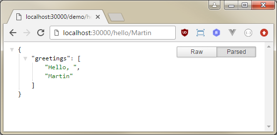

# Hello World, This Is The Advanced SV Lab!

This is a demonstration of more advanced _stateful simulation_ of REST service
with dynamic responses using _simulation variables_.


## Running the demo
When you have installed and run the SV Lab server (see the [common demo
prerequisites in demo index](../README.md)), you can 
quickly launch the demo from command line with the commands:
```sh
mvn compile
mvn exec:java
```

You'll see the prompt when everything is ready. Then you can hit the simulated
endpoint from the web browser:

 * [http://localhost:9000/hello](http://localhost:9000/hello)


## Source code
```
.
|  pom.xml ..................................... project for your IDE
\--src
   \--main
      +--java
      |  \--demo
      |     HelloWorld.java .................... the code configuring and 
      |                                          launching the virtual REST 
      \--resources                               service in simulation mode
         |  sv-lab.json ........................ virtual lab configuration
         \--demo
            HelloAdvancedApplicationModel.js ... hosts the simulated service
            HelloAdvancedServiceModel.js ....... defines the behavior of
                                                 simulated Hello Service
```


## How it works

### Service Model
The behavior of the service is described by _service model_ defined in the
`src/test/resources/demo/HelloAdvancedServiceModel.js`. It is written using
domain specific language based on [ECMAScript 6](http://es6-features.org).

All the
service virtualization domain related language constructs are imported from
the `lib/sv-vsl.js` file:
```javascript
import * as sv from "../../../../../lib/sv-vsl.js"
```

Every _service model_ extends the _ServiceModel_ class:
```javascript
export class HelloAdvancedServiceModel extends sv.ServiceModel {
    ...
```

There is the service passed as a constructor parameter and stored for further
use in scenarios. The type of the service can be either a custom _service 
interface_ (see the documentation for further details) or a generic 
`RestServiceInterface` like in this example:
```javascript
constructor(service: sv.RestServiceInterface) {
    super(service);
    this.service = service;
}
```


#### Service Scenario
Each kind of behavior the service can simulate is described in a _scenario_.
Every scenario is a method annotated with the `@scenario` annotation:
```javascript
@sv.scenario
simpleSayHello() {
    ...
}
```

The scenario contains a sequence of service calls describing the request and
response:
```javascript
this.service.GET("/hello/{name}")
    .withRequest()
        .withPathParameters({name:yourName})                    // URI parameter bound to the scenario variable
    .withResponse({message : "Hello, world!"}, sv.JSON)         // first response                     
        .withHeaders({"Content-Type": "application/json"})     
        .withStatusCode(200);

this.service.GET("/hello/{name}")
    .withRequest()
        .withPathParameters({name:yourName})                    // URI parameter bound to the scenario variable
    .withResponse({message : "Hello again, world!"}, sv.JSON)   // second response                     
        .withHeaders({"Content-Type": "application/json"})     
        .withStatusCode(200);           
```
Every time such scenario is simulated, it expects a GET request with some URI
parameter (like `/hello/Martin`) and with headers exactly as described in
a first call and then returns the first response of _JSON_ type. Then it
expects a similar request and returns the second response (`Hello again...`).

Note that there is sometimes request to unknown resource ```/favicon.ico```
reported during the simulation in console/log. This is perfectly normal since we
are hitting our service with a web browser and most browsers [try to fetch the
resource](https://en.wikipedia.org/wiki/Favicon) whenever you hit a new web
page. We have omitted the call from service model for sake of simplicity.


#### Stateless simulation fallback
When the simulator does not match the expected message (because of request
parameters, headers or body mismatch), it falls back to the stateless simulation
strategy: It responds with the first message from the scenario.


#### Simulation Variables
The clients may behave in a different way each time the simulation is run. The
_simulation variables_ enable you to deal with such situations. They can be used
in two ways in the service scenario:
   * To copy data from requests to responses.
   * To ignore request headers (since each client may have filled them
     differently and they are not crucial for our functionality).


##### Dynamic responses
During the simulation the client requests may contain some dynamic values
varying each time the simulation is run or when the request is sent. The 
_simulation variables_ allow you to capture such values during the simulation
and send them in responses. In our example, we have one dynamic value as the URI
parameter: The name to greet to.  

First, we declare the simulation variable and its default value:
```javascript
let yourName = sv.svVar("world");
```

Then we assign the variable to two places: The request URI parameter and
a property in the response body:
```javascript
this.service.GET("/hello/{name}")
    .withRequest()
        .withPathParameters({name:yourName}) // URI parameter name bound to the variable yourName
    .withResponse({
              "greetings": [
                  "Hello, ",
                  yourName]                  // variable yourName bound to the response
          }, sv.JSON)                        
        .withStatusCode(...);
```
Note that the simulator will ignore the the actual variable value when matching
calls from the scenario thus responding to a request with any _name_ value.


#### Ignoring the request headers
Different REST clients send different request headers. In order to build
a robust simulation it is reasonable to ignore the headers in most cases rather
than use them to control the simulation. The simulator ignores REST headers by
default. When you need to return different responses depending on particular
header value, you can use a construct with _final simulation variable_.
```javascript
return this.service.GET("/hello")
    .withRequest()                                             
        .withHeaders(sv.svVar({"MyHeader":sv.svVar("42").setFinal(), "Accept": "application/json", "...":"..."})) 
    .withResponse(...)
        ...
```
There are two nested simulation variables in headers: the top level one 
encapsulating all headers says "ignore everything". The inner variable with
_.setFinal()_ modifier means overrides the top level one with "except this value
can not change, it must be always equal to 42". The values of _Accept_ and all
other header will be ignored during simulation so the same behavior can be
achieved with simpler expression:  
```javascript
return this.service.GET("/hello")
    .withRequest()                                             
        .withHeaders(sv.svVar({"MyHeader":sv.svVar("42").setFinal()})) 
    .withResponse(...)
        ...
```
Please note that following example would not usually do what you need because it
would have matched the request only in case when there was EXACTLY ONE header in
the request (which is usually not the case due to headers added by HTTP client
by default).
```javascript
return this.service.GET("/hello")
    .withRequest()                                             
        .withHeaders({"MyHeader":sv.svVar("42")}) 
    .withResponse(...)
        ...
```


### Application Model
The SV Lab can simulate multiple virtual services in parallel exhibiting various
behaviors during different test cases. For each test case, there is an
application scenario declared. It is then run at the moment the test is
initiated.

In this example, we declare one `sayHello` application scenario using only one
service:
```javascript
@sv.applicationScenario
sayHello() {
    this.smHelloServiceModel.simpleSayHello();
}
```
and then launch it from Java:
```java
sv.runSimulation("sayHello");
```


### Virtual Lab
In order to run and use the simulation, we have to configure and start
a _virtual lab_. The virtual lab can be configured using a JSON file or it can
be set-up and controlled over the _SV API_.

In this example, we load the lab configuration from the 
`src/main/resources/sv-lab.json` file and compile the _module_ from application
and service model sources (`HelloAdvancedApplicationModel.js` and
`HelloAdvancedServiceModel.js`):
```java
final String labConfigPath = "classpath:/sv-lab.json";
final String vslPath = "classpath:/demo/*";
sv.loadActiveVirtualLab(labConfigPath, sv.compileModuleFromSources(vslPath), true);
```

It is convenient to keep the VSL sources and `sv-lab.json` file in the
`resources` directory and access them with `"classpath:/..."` [Spring resource
locators](https://docs.spring.io/spring/docs/3.2.x/spring-framework-reference/html/resources.html#resources-resourceloader).
Alternatively, you can use relative (`"file:target/classes/sv-lab.json"`) or
even absolute
(`"file:///c:/test/sv-demos/hello-world-advanced/target/classes/sv-lab.json"`) 
paths to locate the files.  

In the configuration file we define the virtual lab where all the services will 
run and pick the application model to use:
```javascript
"virtualLab": [
  {
    "id": "virtual-lab:9000",
    "displayName": "Hello Lab",
    "applicationModelId": "HelloAdvancedApplicationModel",
    "connector": ...,
    "virtualServiceInstance": ...
  }
]
```

Then we create a _HTTP connector_ providing connectivity for the REST _virtual 
service_ we want to simulate.
```javascript
"connector": [
  {
    "id": "connector",
    "connectorType": "httpGateway",
    "properties": {
      "bindPort": 9000
    }
  }
]
```

Here we create a service instance specifying the _virtual endpoint path_ where 
it will be exposed and choosing the `SIMULATE_SERVICE` simulation mode.
```javascript
"virtualServiceInstance": [
  {
    "virtualServiceId": "HelloAdvancedServiceModel.RestServiceInterface",
    "serviceMode": "SIMULATE_SERVICE",
    "endpoints": [
      {
        "properties": {
          "httpVirtualPath": "/"
        },
        "connectorId": "connector"
      }
    ]
  }
]
```

Then we start the _virtual lab_ ant the _sayHello_ scenario from Java and we are
ready to go!
```java
sv.startActiveVirtualLab();
sv.runSimulation("sayHello");
```

