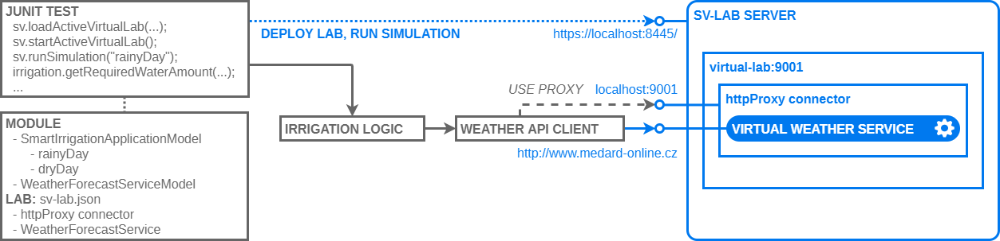

# This Is How SV Lab Can Help Your Integration Tests

This is a demonstration of simulation of REST service that is configured
and launched from a [JUnit](http://junit.org/) test run with 
[Apache Maven](https://maven.apache.org/).

You can use it as a template for building your own virtual services and
embedding them in your tests.

The application being tested is controlling an irrigation system in
a clever way. It will reduce the amount of water used for irrigation 
according to the forecast of precipitation for next 24 hours.


To test the application logic, we want to verify its behavior under 
conditions of rainy weather when the irrigation should conserve water as well
as on dry weather when the irrigation should not be reduced.
We have created two scenarios simulating different weather forecast for
each of the two tests:

```java
@Test
public void testWaterSavingOnRainyDay() throws Exception {
    sv.runSimulation("rainyDay");
    ...
}

@Test
public void testIrrigationOnDryDay() throws Exception {
    sv.runSimulation("dryDay");
    ...
}
```


## Running the demo
When you have installed and run the SV Lab server (see the [common demo
prerequisites in demo index](../README.md)), you can quickly launch the demo 
from command line with the command:
```sh
mvn test
```

You'll see the test result as well as the messages being simulated in console
output:

```

-------------------------------------------------------
 T E S T S
-------------------------------------------------------
Running demo.SmartIrrigationTest
...
12:00:29.235 [Thread-1] INFO  [SV_RUNLOG] com.microfocus.sv.model.lab.SimulationEventLogEntryImpl - com.microfocus.sv.lab.LabServiceImpl: Scenario has started: rainyDay
...
12:00:30.492 [Thread-2] INFO  [SV_RUNLOG] com.microfocus.sv.model.lab.SimulationMessageLogEntryImpl - SimulationEngine: callId=virtual-service:48225451737088:service-model:112:scenario:115:call:4
    at WeatherForecastServiceModel.dryDayMeteogram(WeatherForecastServiceModel.js:62)
MESSAGE
RESPONSE { // JSON
    HTTP:properties[0]: { // ResponseHttpProperties
        HTTP:status-code[0]: "200"
    },
    REST:payload[0]: { // object
        data[0]: { // object
            rain_dif[0]: { // object
                max[0]: "10"
                values[0]: { // array
                    array item[0]: "0"
                    array item[1]: "0"
                    ...
                },
                gridStep[0]: "1"
                min[0]: "0"
            },
        },
    },
}
...
Tests run: 2, Failures: 0, Errors: 0, Skipped: 0, Time elapsed: 5.492 sec

Results :

Tests run: 2, Failures: 0, Errors: 0, Skipped: 0

[INFO] ------------------------------------------------------------------------
[INFO] BUILD SUCCESS
[INFO] ------------------------------------------------------------------------
```


## Source code
```
.
|  pom.xml ....................................... project for your IDE
\--src
   \--main
      \--java
         \--demo
            IrrigationLogic.java ................. the application under test
            WatherClient.java .................... weather forecast client used
   \--test                                         by irrigation logic
      +--java
      |  \--demo
      |     SmartIrrigationTest.java ............. the test configuring SV Lab
      \--resources                                 and running the simulation
         |  sv-lab.json .......................... virtual lab configuration
         \--demo                           
            SmartIrrigationApplicationModel.js ... hosts the simulated service
            WeatherForecastServiceModel.js ....... defines the behavior of
                                                   simulated weather forecast
                                                   service
```


## How it works


The JUnit test for the _IrrigationLogic_ is accompanied by simulation models and 
virtual lab configuration. The test compiles model sources and deploys the
virtual lab in the initialization phase. The _WeatherClient_ is configured to
use a HTTP proxy connector in virtual lab when talking to the _WeatherService_
directing it to virtual service. The virtual service responds according to
running scenario simulating desired conditions for every test case.  


### Application Model
The _SmartIrrigationTest_ contains two test cases, each requiring different
weather forecast to be simulated so we have two scenarios in the application
model in ```src/main/resources/demo/SmartIrrigationApplicationModel.js```:
```javascript
@sv.applicationScenario
rainyDay() {
    this.weatherForecastServiceModel.rainyDayMeteogram();
}

@sv.applicationScenario
dryDay() {
    this.weatherForecastServiceModel.dryDayMeteogram();
}
```


### Service Model
The actual behavior of the weather forecast service is defined in the 
```src/main/resources/demo/WeatherForecastServiceModel.js```. The
_WeatherClient_ performs two REST calls to obtain current forecast. First it
gets the ID of latest weather forecast run at the Czech Hydrometeorological
Institute's supercomputer:
```javascript
this.service.GET("/apirun")
    .withRequest()
    .withResponse({
        "id": "190515_12"
    }, sv.JSON)                                                 
    ...
```
Then it fetches the actual forecast data in a second call:
```javascript
        this.service.GET("/apimeteogram")
            .withRequest()
                .withQueryParameters(sv.svVar({}))                   
            .withResponse({
                "data": {
                    "rain_dif": {
                        "max": 10.0,
                        "values": [
                            2.1297, 1.2324, 2.4592, 2.5837, 2.5626, 1.4771,
                            ...
```  

The real service at http://www.medard-online.cz returns much more forecast
information but we kept our model simple by mocking just the data actually
consumed by _WeatherClient_ in our application - the forecast run ID and the
```rain_dif``` precipitation forecast in particular. 


### Virtual Lab
In order to run and use the simulation, we have to configure and start
a _virtual lab_. The virtual lab can be configured using a JSON file or it can
be set-up and controlled over the _SV API_.

In this example, we load the lab configuration from the
`src/main/resources/sv-lab.json` file and compile the _module_ from application
and service model sources (`SmartIrrigationApplicationModel.js` and
`WeatherForecastServiceModel.js`):
```java
final String labConfigPath = "classpath:/sv-lab.json";
final String vslPath = "classpath:/demo/*";
sv.loadActiveVirtualLab(labConfigPath, sv.compileModuleFromSources(vslPath), true);
```

It is convenient to keep the VSL sources and `sv-lab.json` file in the
`resources` directory and access them with `"classpath:/..."` 
[Spring resource locators](https://docs.spring.io/spring/docs/3.2.x/spring-framework-reference/html/resources.html#resources-resourceloader).
Alternatively, you can use relative (`"file:target/test-classes/sv-lab.json"`) or
even absolute
(`"file:///c:/test/sv-demos/smart-irrigation-maven/target/test-classes/sv-lab.json"`) paths to
locate the files.  

In the configuration file we define the virtual lab where all the services will
run and pick the application model to use:
```javascript
"virtualLab": [
  {
    "id": "virtual-lab:9000",
    "displayName": "Smart Irrigation Test Virtual Lab",
    "applicationModelId": "SmartIrrigationApplicationModel",
    "connector": ...,
    "virtualServiceInstance": ...
  }
]
```

Then we create a _HTTP proxy connector_ providing connectivity for the REST
_virtual service_ we want to simulate.
```javascript
"connector": [
  {
    "id": "connector",
    "connectorType": "httpProxy",
    "properties": {
      "bindPort": 9000
    }
  }
]
```

Here we create a service instance specifying the _service url_ where it will be
exposed and choosing the `SIMULATE_SERVICE` simulation mode.
```javascript
"virtualServiceInstance": [
  {
    "virtualServiceId": "WeatherForecastServiceModel.RestServiceInterface",
    "serviceMode": "SIMULATE_SERVICE",
    "endpoints": [
      {
        "properties": {
          "httpServiceUrl": "http://www.medard-online.cz"
        },
        "connectorId": "httpConnector"
      }
    ]
  }
]
```

We start the _virtual lab_:
```java
sv.startActiveVirtualLab();
```

Then we are ready to simulation scenarios in test methods:
```java
@Test
public void testWaterSavingOnRainyDay() throws Exception {
    sv.runSimulation("rainyDay");
    ...
}
```
