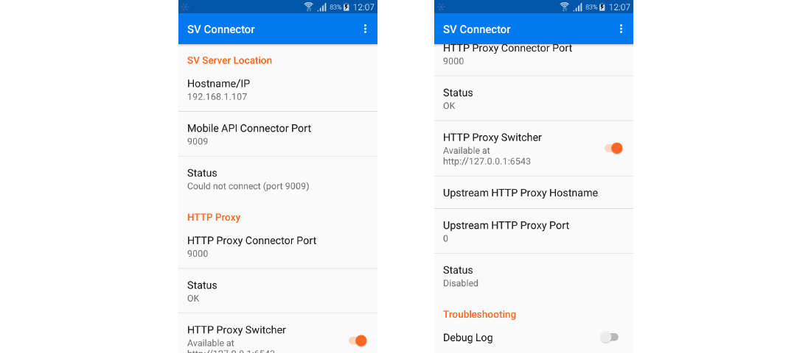
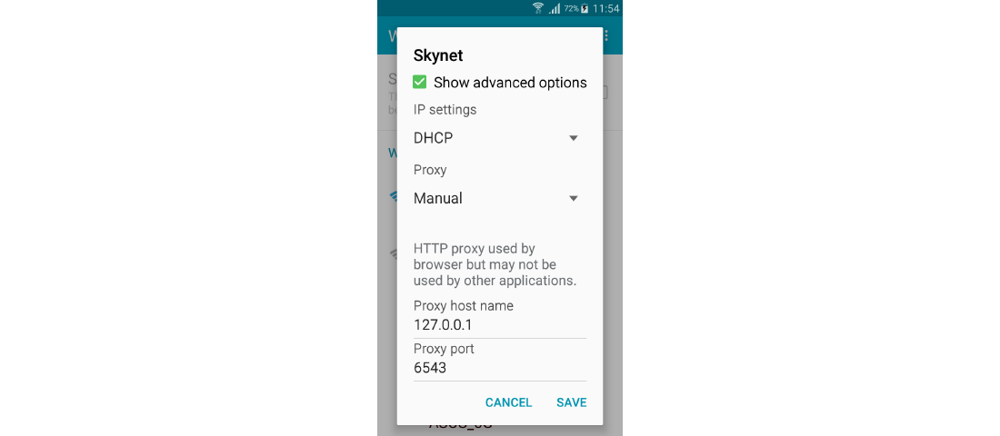
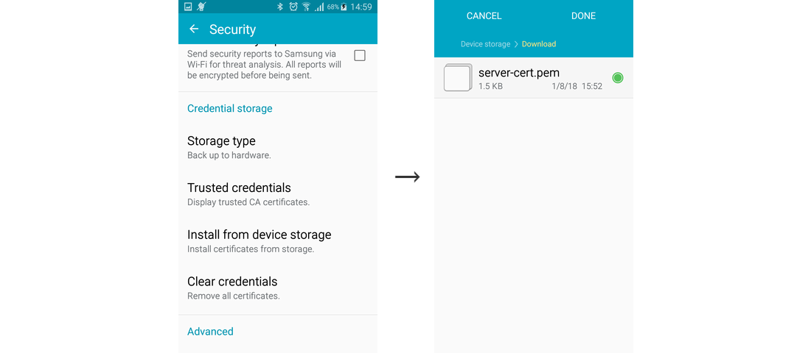

# WeatherForecast, REST Learning And Simulation In Android UFT Mobile Test

This demo showcases an automated _UFT Mobile_ test testing the Forecastie mobile
application running on Android phone connected via _UFT Mobile_ while the
backend REST service is being simulated in _SV Lab_.

There is a similar demo, [weather-forecast](../weather-forecast/README.md),
using Appium test framework for automated test and demonstrating the learning
of simulation models in addition to the automated testing.  

This demo uses the [Forecastie](https://github.com/martykan/forecastie)
open source application using [OpenWeatherMap](https://openweathermap.org/) REST
API.

Development and testing of such application involves testing the application 
with various weather conditions which may be hard to achieve using real data. 
The simulation helps to provide different weather conditions including extremes 
at one moment.   


## Prerequisites
  * [Java SDK](https://openjdk.java.net/)
  * [Apache Maven](https://maven.apache.org/)
  * A smartphone with _Android 5.0 Lollipop_ or newer connected to WiFi
  * [UFT Mobile 3.5](https://www.microfocus.com/en-us/products/uft-mobile) or 
    newer
  * UFT Mobile [execution access key](https://admhelp.microfocus.com/mobilecenter/en/3.5/Content/Admin-Tokens.htm#mt-item-1)
    created in _Settings/Access Keys_ in UFT Mobile  
  * [UFT Developer 15.0.2](https://www.microfocus.com/en-us/products/uft-developer)
    or newer [connected to UFT Mobile](https://admhelp.microfocus.com/leanft/en/15.0/HelpCenter/Content/HowTo/Integ_MC.htm)  


### Step 1: Installing the UFT Developer Java libraries
The UFT Developer libraries have to be installed in local Maven repository prior
running the demo.

Navigate to the `SDK/Maven` subdirectory in the UFT Developer installation
directory (i.e. `"c:\Program Files (x86)\Micro Focus\UFT Developer\SDK\Maven"`),
then run following commands from there: 

```sh
mvn install:install-file -DpomFile=com.hp.lft.sdk-15.0.2-pom.xml -Dfile=com.hp.lft.sdk-15.0.2.jar
mvn install:install-file -DpomFile=com.hp.lft.common-15.0.2-pom.xml -Dfile=com.hp.lft.common-15.0.2.jar
mvn install:install-file -DpomFile=com.hp.lft.unittesting-15.0.2-pom.xml -Dfile=com.hp.lft.unittesting-15.0.2.jar 
mvn install:install-file -DpomFile=com.hp.lft.report-15.0.2-pom.xml -Dfile=com.hp.lft.report-15.0.2.jar 
mvn install:install-file -DpomFile=com.hp.lft.reportbuilder-15.0.2-pom.xml -Dfile=com.hp.lft.reportbuilder-15.0.2.jar
``` 


### Step 2: Mobile phone configuration
Now you need to configure the _Android_ phone to connect to your PC
running the simulation. Most of the configuration is done automatically
once you connect the phone to UFT Mobile (the SV integration must be enabled
for that particular phone in `UFT Mobile/server/conf/connector.properties`,
see [UFT Mobile documentation](https://admhelp.microfocus.com/mobilecenter/en/3.5/Content/Set%20up%20Service%20Virtualization.htm)
for more information).

You can verify this step by locating the SV Connector Configuration utility
installed on the phone by UFT Mobile and checking the connection to HTTP Proxy
connector:



To virtualize REST services on Android phone, you need to make it talk to the
_HTTP proxy connector_. You achieve this by configuring proxy settings of your
current WiFi connection on the phone. Within the WiFi settings, enable proxy
selecting _Manual_ and set the proxy host name to `127.0.0.1` and port to
`6543`:



To enable virtualization of services over HTTPS, import the
`../lib/sv-capture.pem` certificate into _User Certificates_ on the phone. 
Choose to use the certificate for _VPN and apps_ when asked.
   * One way is to upload the file over USB cable and go to
     _Settings/Security/Credential storage_ and perform _Install from device
     storage_.
   * Another option is to send the certificate by e-mail to phone account and
     open the attachment in e-mail app.



To verify the settings, launch a discovery mode using sv-capture tool, open
a web browser in your smartphone and try to display some web page, e.g.
[https://openweathermap.org/](https://openweathermap.org/). Provide your UFT
Mobile server URL, access key and mobile phone name with `-mn` argument or 
mobile phone ID with `-mi` parameter:
```sh
../../bin/sv-capture.sh -ms http://localhost:8080 -ma "client=oauth2-..." \
                        -mn SM-G800F -d
```
In Windows:
```bat
..\..\bin\sv-capture.bat -ms http://localhost:8080 -ma "client=oauth2-..." ^
                         -mn SM-G800F -d
```

The page should display in browser and you should see the endpoint printed out
by the _sv-capture_ tool.

Now **stop the virtual lab pressing the \<Enter> key** in the console window
where you've run the _sv-capture_ tool.


### Step 3: Installing the Forecastie application
Download the [_"Forecastie - Weather app"_ from F-Droid](https://f-droid.org/en/packages/cz.martykan.forecastie/)
to disk and upload to UFT Mobile. Install the packaged version of application on
Android 7.0+ (because of server certificate trust instrumentation). You can use
non-packaged version on older Android versions.


### Running the automation test
Edit the `demo.properties` file and enter the device ID of Android phone 
connected to UFT Mobile to use in test, `uftm.deviceId=5200...`.

Then run `mvn test` within the demo directory.


## How it works
The `setupBeforeClass()` method in the test class will compile simulation models
located in `src/test/resources` and deploy and start the virtual lab on the SV
Lab server embedded in UFT Mobile:

```java
@BeforeClass
public static void setUpBeforeClass() throws Exception {
    ...
    device = MobileLab.lockDevice(...);

    // create SV Lab
    sv = SvClient.newInstance(device.getSvInfo().getEndpoint());
    sv.loadActiveVirtualLab("classpath:/sv-lab.json", sv.compileModuleFromSources("classpath:/demo/*"), true);
    sv.startActiveVirtualLab();
}
```

After that, each test can simulate required behavior of virtual services by
running the corresponding application scenario from the simulation model:
```java
@Test
public void test() throws Exception {
    sv.runSimulation("weatherForecast");
    ...
}
```


## Source code
```
.
|  pom.xml ............................................. Maven project file
|  demo.properties ..................................... test property file
|  sv-capture.pem ...................................... certificate for mobile 
\--src                                                   phone
   \--test
      +--java
      |  \--demo
      |        WeatherForecastTest.java ................ automatic JUnit test
      \--resources
         |  sv-lab.json ................................ virtual lab configuration
         \--demo                                         the ready-to-run
               WeatherUftApplicationModel.js ........... 'capture' scenario
               WeatherUftServiceInterface.js ........... service interface
               WeatherUftServiceInterfaceSwagger.json .. Swagger description
               WeatherUftServiceModel.js ............... service scenarios
```
