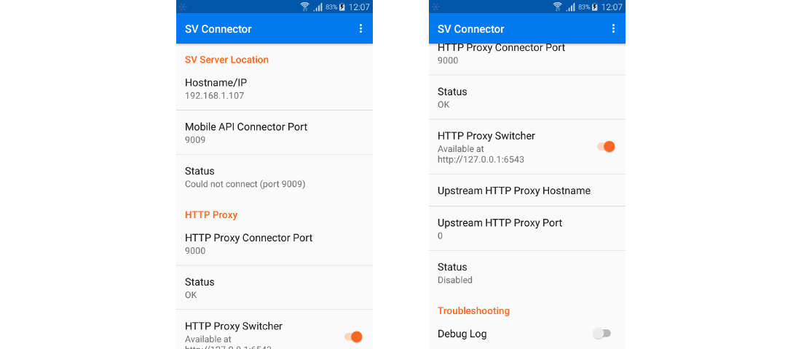
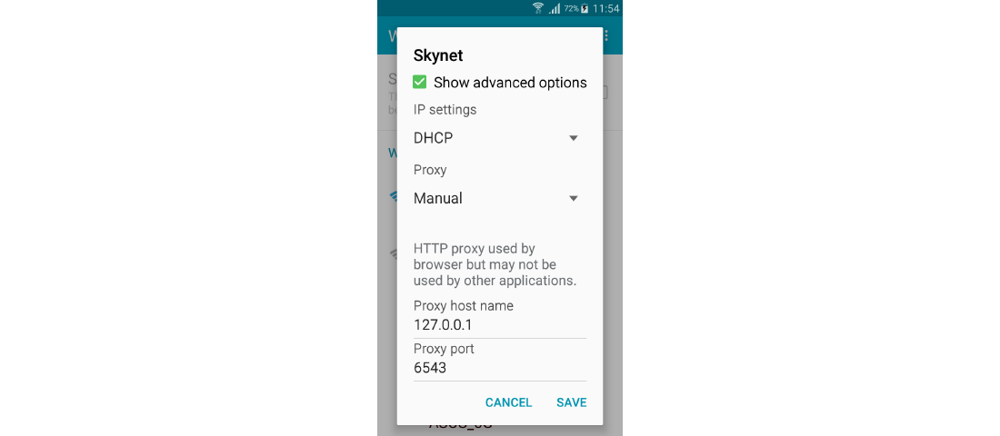
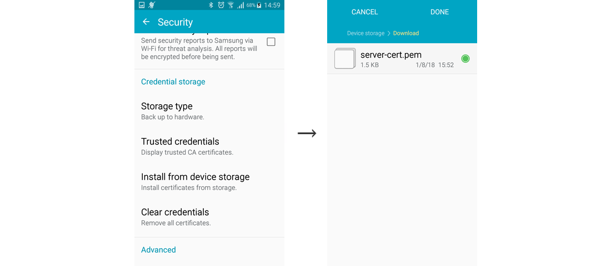
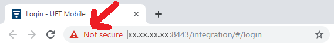
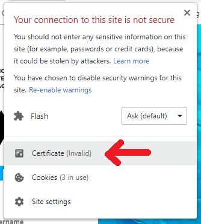
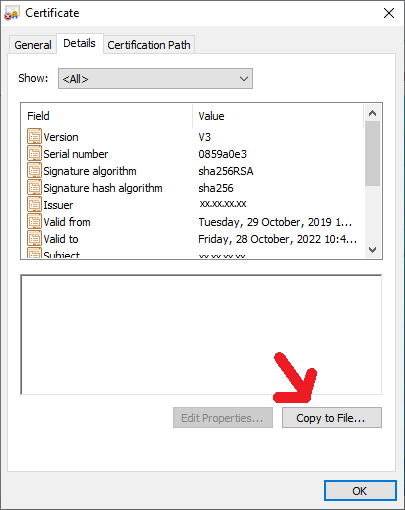

# WeatherForecast, REST Learning And Simulation In Android Appium Test

A demonstration of the REST backend service learning and simulation on Android.

This demo uses the [Forecastie](https://github.com/martykan/forecastie)
open source application using [OpenWeatherMap](https://openweathermap.org/) REST
API.

Development and testing of such application involves testing the application 
with various weather conditions which may be hard to achieve using real data. 
The simulation helps to provide different weather conditions including extremes 
at one moment.   

There are 3 ways how to experience this demo:

  1. **Manual setup and out-of-box simulation**
       <br/>Use the ready-made learned simulation model to demonstrate 
       the simulation of the application's backend service
       (https://openweathermap.org/).
  2. **Learning the simulation models**
       <br/>Walk through the learning of the current weather conditions 
       at a custom location, editing and running the simulation.
  3. **Automation test setup and simulation**
       <br/>Use _Service Virtualization_ together with _UFT Mobile_ to run 
       an automatic _JUnit_ test of the application using _Maven_.


## Prerequisites

  * SV Lab client distribution (the `sv-capture` tool used for setup validation
    and learning)
  * [UFT Mobile](https://admhelp.microfocus.com/mobilecenter/) installed and 
    running (for all 3 demo cases) or ADB tool (manual setup/simulation
    and learning demo only)
  * UFT Mobile access key for execution created in _Settings/Access Keys_ in
    UFT Mobile (for automation test)  
  * A smartphone with _Android 5.0 Lollipop_ or newer connected to UFT Mobile 
    and WiFi
  * [Apache Maven](https://maven.apache.org/) tool or Java IDE (for automation
    test)


### Step 1: Mobile phone configuration
Now you need to configure the _Android_ phone to connect to your PC
running the simulation. Most of the configuration is done automatically
once you connect the phone to UFT Mobile (the SV integration must be enabled
for that particular phone in `UFT Mobile/server/conf/connector.properties`,
see UFT Mobile documentation for more information).

You can verify this step by locating the SV Connector Configuration utility
installed on the phone by UFT Mobile and checking the connection to HTTP Proxy
connector:



To virtualize REST services on Android phone, you need to make it talkto the the
_HTTP proxy connector_. You achieve this by configuring proxy settings of your
current WiFi connection on the phone. Within the WiFi settings, enable proxy
selecting _Manual_ and set the proxy host name to `127.0.0.1` and port to
`6543`:



To enable virtualization of services over HTTPS, import the
`../lib/sv-capture.pem` certificate into _User Certificates_ on the phone. 
Choose to use the certificate for _VPN and apps_ when asked.
   * One way is to upload the file over USB cable and go to
     _Settings/Security/Credential storage_ and perform _Install from device
     storage_.
   * Another option is to send the certificate by e-mail to phone account and
     open the attachment in e-mail app.



To verify the settings, launch a discovery mode using sv-capture tool, open
a web browser in your smartphone and try to display some web page, e.g.
[https://openweathermap.org/](https://openweathermap.org/). Provide your UFT
Mobile server URL, access key and mobile phone name with `-mn` argument or 
mobile phone ID with `-mi` parameter:
```sh
../../bin/sv-capture.sh -ms http://localhost:8080 -ma "client=oauth2-..." \
                        -mn SM-G800F -d
```
In Windows:
```bat
..\..\bin\sv-capture.bat -ms http://localhost:8080 -ma "client=oauth2-..." ^
                         -mn SM-G800F -d
```

The page should display in browser and you should see the endpoint printed out
by the _sv-capture_ tool.

Now **stop the virtual lab pressing the \<Enter> key** in the console window
where you've run the _sv-capture_ tool.


### Step 2: Installing the Forecastie application
Download the [_"Forecastie - Weather app"_ from F-Droid](https://f-droid.org/en/packages/cz.martykan.forecastie/)
to disk and upload to UFT Mobile. Install the packaged version of application on
Android 7.0+ (because of server certificate trust instrumentation). You can use
non-packaged version on older Android versions.


## Manual setup and out-of-box simulation
Lets follow this high level workflow for a quick simulation of the backend 
service to test the application with specific weather conditions. There is 
a ready-to-run simulation model bundled with the demo in so the only thing you 
need to do is to launch the virtual lab.


### Simulating the backend service
To run the backend service simulation using an out-of-box model, run:
```sh
../../bin/sv-capture.sh -ms http://localhost:8080 -ma "client=oauth2-..." \
             -mn SM-G800F \
             -m SIMULATE -vsl src/test/resources/demo -as weatherForecast \
             -r https://api.openweathermap.org \
```
In Windows:
```bat
..\..\bin\sv-capture.bat -ms http://localhost:8080 -ma "client=oauth2-..." ^
             -mn SM-G800F ^
             -m SIMULATE -vsl src/test/resources/demo -as weatherForecast ^
             -r https://api.openweathermap.org
```

Open the _Forecastie_ app on your smartphone and tap on the _Refresh button_. 
Now you should see simulation logs appearing on your console running 
_sv-capture_ tool.

You can modify the service model
`src/test/resources/demo/WeatherServiceModel.js` and restart the simulation to
simulate different weather conditions.


## Learning the backend service simulation model
Start learning by running:

```sh
../../bin/sv-capture.sh -ms http://localhost:8080 -ma "client=oauth2-..." \
             -r https://api.openweathermap.org -as weatherForecast \ 
             -o ./learned-model
```

In Windows:
```bat
..\..\bin\sv-capture.bat -ms http://localhost:8080 -ma "client=oauth2-..." ^
             -r https://api.openweathermap.org -as weatherForecast ^ 
             -o ./learned-model
```

Then open the _Forecastie_ app on your smartphone and tap on the _Refresh_ 
button. Alternatively, you can change your location to display a forecast for 
another location. The messages to backend services are being recorded as you can
see in the _sv-capture_ console output.

Now stop the learning by pressing _Enter_ within the console running the 
_sv-capture_ tool.

The learned model is located witihn the `learned-model` directory. You can check
and modify learned scenarios and data.

Simulate the learned model by running:
```sh
../../bin/sv-capture.sh -ms http://localhost:8080 -ma "client=oauth2-..." \
             -m SIMULATE -vsl ./learned-model -as weatherForecast \
             -r https://api.openweathermap.org
```

In Windows:
```bat
..\..\bin\sv-capture.bat -ms http://localhost:8080 -ma "client=oauth2-..." ^
             -m SIMULATE -vsl ./learned-model -as weatherForecast ^
             -r https://api.openweathermap.org
```

Restart the _Forecastie_ app and repeat the actions against the simulation using
the learned model.


## Automation test setup and simulation
The _SV Lab_ allows you to develop an automatic UI test of your _Android_ 
application which can run within CI environment like 
[Jenkins](https://jenkins.io/) or [TeamCity](https://www.jetbrains.com/teamcity/).
In such environment, there are typically more build agents running on different 
machines using different hostnames or IP addresses. 


### Running the automation test
Edit the demo.properties file and enter valid values for your environment:
   * `uftmUrl` is a URL of the _UFT Mobile_ server.
   * `oauthClientId`, `oauthClientSecret` and `tenantId` are the components of
     execution access key generated in UFT Mobile _Settings/Access Keys_

Then run `mvn test` within the demo directory.

_Note:_ If your UFT Mobile server exposes a secure endpoint, the test must trust 
its certificate.
   * Download the certificate to a file by clicking on the icon near to the 
     address bar of your browser displaying UFT Mobile's web console:
     
     
         
     Save the certificate as the `uftm.crt` file into the demo root directory.
   * Create a Java JKS truststore file using the JDK `keytool` command line 
     utility:     
     `keytool -import -trustcacerts -file uftm.crt -keystore trust.jks -storepass changeit -noprompt`
   * Edit the `demo.properties` file and uncomment the following lines:
    `javax.net.ssl.trustStore=trust.jks` 
    `javax.net.ssl.trustStorePassword=changeit` 


## Source code
```
.
|  pom.xml .......................................... Maven project file
|  demo.properties .................................. test property file
|  sv-capture.pem ................................... certificate for mobile 
\--src                                                phone
   \--test
      +--java
      |  \--demo
      |        WeatherForecastTest.java ............. automated JUnit test
      \--resources
         |  sv-lab.json ............................. virtual lab configuration
         \--demo                                      the ready-to-run
               WeatherApplicationModel.js ........... 'weatherForecast' scenario
               WeatherServiceInterface.js ........... service interface
               WeatherServiceInterfaceSwagger.json .. Swagger description
               WeatherServiceModel.js ............... service scenarios
```
